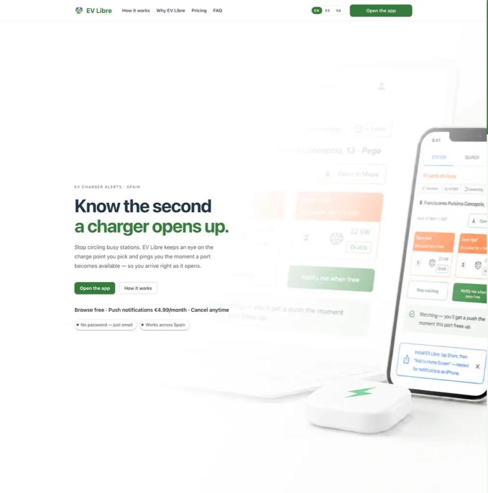
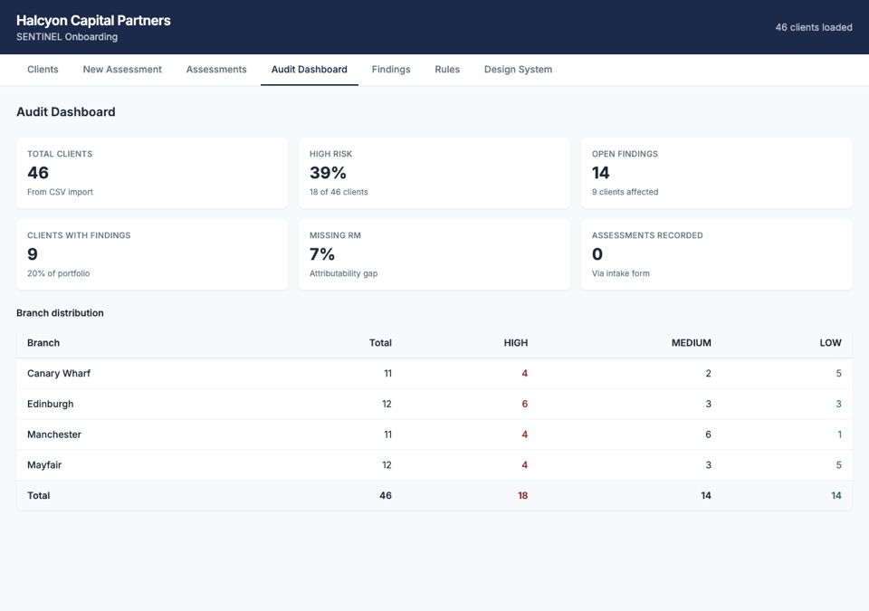
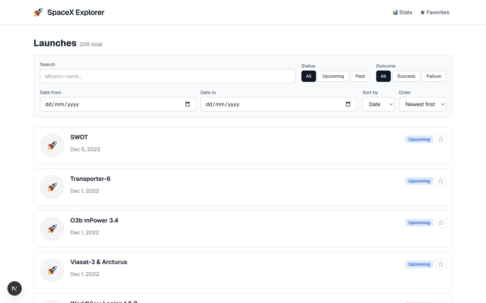
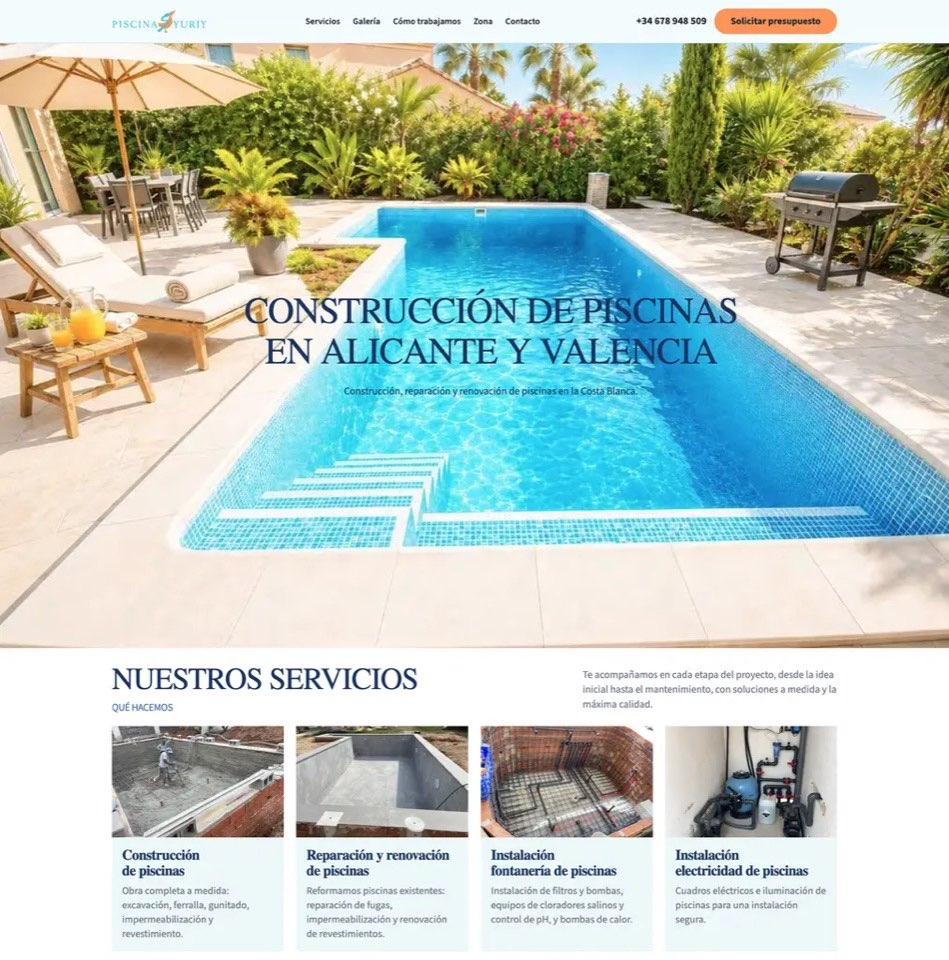

## Andrey Kotko

**Fullstack Engineer**

**[kotkoa@gmail.com](mailto:kotkoa@gmail.com)** | residence: Spain + work-permit | +34-647-185-406  
[Linkedin](https://www.linkedin.com/in/kotkoa) | [Github](https://github.com/Kotkoa) | [Twitter](https://twitter.com/Kotkoa)  
[Telegram: @Kotkoa](https://t.me/Kotkoa) | [Download CV](assets/Andriy_Kotko_CV.pdf) | [Online CV](https://kotkoa.github.io/my-cv/)

### ABOUT ME

I build the frontend for AI-powered products — and I've shipped the hard parts most React engineers never touch: real-time AI streaming, conversational voice UIs, and deep GraphQL data layers. Senior Frontend Engineer, 4+ years of commercial React/TypeScript/Next.js across distributed international teams, most recently on contract. Currently building and running my own product (EV Libre) end-to-end while open to my next role.

**Proof:** at CloneForce (AI digital-clone platform on OpenAI, Pinecone/RAG, ElevenLabs) I was the main frontend contributor — real-time human–AI interaction via GraphQL subscriptions, a custom ElevenLabs voice chat UI, Slack/Teams/WhatsApp connections, and 41 of the app's 49 Cypress specs. And I ship solo: [EV Libre](https://evlibre.cc) is my real-time PWA (React 19, Supabase Realtime, web push) live in production today. Earlier, at an equity-trading platform (HCX), I grew into the de facto lead frontend engineer and shipped the investing flow, investor accreditation, and the platform's first KYC flow.

**Differentiators:** deep Apollo Client expertise (custom cache strategies, type policies, AC3→4 migration, WebSocket subscriptions), design systems across four production projects (Yara International, HCX, Bridge The Gap, CloneForce), and a strong testing culture (Jest, Cypress, Playwright) with WCAG-accessible, performance-tuned UIs.

Based in Pego, Spain — work permit in hand, available now for remote roles across Europe (CET/CEST).

---

### TECHNICAL SKILLS

**Core (what I'm hired for):**
- **Frontend:** React, TypeScript, Next.js (SSR/SSG), JavaScript ES6+
- **Data:** Apollo Client / GraphQL, GraphQL Subscriptions, REST APIs
- **AI integrations:** ElevenLabs SDK, RAG-aware UIs, OAuth integrations (Slack, Microsoft Teams)
- **Design systems:** MUI, Tailwind, Storybook, Radix UI, Design Tokens, Accessibility (WCAG)
- **Testing:** Jest, Cypress, Playwright, React Testing Library

**Also experienced with:** Redux / Redux Toolkit, Jotai, MobX, React Context · SASS, Styled Components · Webpack, Vite, CI/CD, ESLint, Prettier · i18n, Nx Monorepo, Figma, Agile/Scrum

---

### EXPERIENCE

#### **Founder & Fullstack Engineer**

**EV Libre — [evlibre.cc](https://evlibre.cc) (Remote, Spain)**  
_November 2025 – Present_

Built end-to-end, solo: a real-time PWA that tracks EV charge-point availability on Spain's Iberdrola network and push-notifies users the moment an occupied port frees up. Live in production; moving from MVP to a paid subscription model. AI-assisted, hypothesis-first workflow with automated review gates and a full test battery on every change.

- Built a React 19 + TypeScript + MUI PWA on Vite: live port status, occupancy timers, nearby search, favorites, magic-link auth — strict TS, no `any`.
- Real-time UI via Supabase Realtime (WebSockets) with a polling fallback; service-worker web push via VAPID across Safari/PWA and Chrome.
- Designed a single-source data contract — a dependency-free Node 20 scraper (GitHub Actions cron) ships raw provider responses; one shared Supabase Edge Function (Deno) validates and writes snapshots to Postgres. Golden-fixture regression tests killed a whole class of parsing-drift bugs.
- Root-caused silent Chrome push failures (missing notification tag); hardened Postgres with explicit privilege revokes, validated via Supabase advisors.

**Tech Stack:** React 19, TypeScript, Vite, MUI, PWA, Supabase (Postgres, Edge Functions/Deno, Realtime), Node.js 20, GitHub Actions, Web Push/VAPID, Yarn workspaces, Vercel

---

#### **FullStack Engineer - Contractor**

**CloneForce, Newport Beach, California, United States (Remote)**  
_November 2024 – March 2026_

FullStack Engineer on an AI-powered digital clone platform that creates personalized AI assistants and coaches powered by OpenAI, Pinecone (RAG), and ElevenLabs, deployed across Slack, MS Teams, and web channels. Developed frontend interfaces for real-time human-AI interactions, conversational voice experiences, and automation workflows within the core web application.

- Developed real-time AI interaction interfaces using GraphQL subscriptions and streaming updates, enabling conversational clone experiences with live AI responses.
- Migrated the UI from Radix UI to MUI in 10 incremental PRs and moved Tailwind CSS from v3 to v4 across 164 files, improving visual consistency across the platform.
- Integrated ElevenLabs voice chat through the React SDK, replacing the default embed widget with a custom implementation for greater control over the conversational voice UI.
- Led the Apollo Client 3 to 4 migration across 136 files and built organization switching that clears cached data and reconnects GraphQL WebSocket subscriptions, so users in several organizations never see another tenant's data.
- Built Slack, Microsoft Teams, and WhatsApp connection flows, allowing clones to securely connect with external platforms on behalf of users.
- Improved frontend development workflows with strict TypeScript, ESLint, GitHub branch protections, and standardized architecture patterns to maintain consistent code quality.
- Improved Largest Contentful Paint on the main clone grid by about 1.2s by deferring heavy third-party scripts and prioritizing above-the-fold images with next/image.
- Wrote 41 of the app's 49 Cypress specs (370+ test cases) covering login, chat, clone creation, and data isolation between organizations.

**Tech Stack:** React, Next.js (SSR), TypeScript, Jotai, Tailwind, SASS, MUI, Apollo GraphQL, GraphQL Subscriptions, ElevenLabs React SDK, Webpack, Jest, Cypress, Git

---

#### **FullStack Engineer — On the Beach (contract via Netguru)**

**On the Beach, Manchester, UK (Remote) — engaged through Netguru | B Corp™**  
_April 2025 – October 2025_

FullStack Engineer in a UK-based team modernizing the On the Beach holiday platform [onthebeach.co.uk](https://www.onthebeach.co.uk/), engaged as a contractor through Netguru ([netguru.com](https://www.netguru.com/)). Worked on a large legacy codebase: refactoring, component modernization, and improving maintainability, performance, and developer experience.

I collaborated with UK colleagues to deliver new features and experiments using JavaScript, TypeScript, GraphQL, React 19, and Next.js 15, employing feature flags for controlled rollouts and quick reversions. My work spanned frontend optimization, API integrations, and user experience enhancements, contributing flexibly across multiple areas of the platform.

As part of the Shop XP team, I've led and contributed to several key initiatives, including:

- Upgrading the Booking Flow technology stack to the latest React 19 and Next.js 15, improving performance, security, and engineering efficiency.
- Implemented feature flags for controlled rollouts and A/B experimentation, shipping about 25 experiments (up to 3 running at once) to support data-driven UI decisions.
- Implementing new UI toggle features, refining default search logic, and expanding tracking coverage for analytics and experimentation.

These improvements have resulted in faster page loads, smoother navigation between search and deal detail pages, and a more reliable, scalable foundation for future development.

**Tech Stack:** JavaScript ES6+, TypeScript, React 19, Next.js 15 (SSR/SSG), MobX, Apollo Client 4, GraphQL, Webpack, Git

---

#### **Frontend Engineer - Contractor**

**Human Capital Exchange (HCX), Los Angeles (Remote)**  
_September 2022 – November 2024_

Developed an [HCX](https://www.hcx.org/) trading platform for a new equity-based asset class using React, TypeScript, GraphQL, Jotai, and Jest.

- Grew into the de facto lead frontend engineer, writing 72–79% of all commits in the second half of 2024.
- Built the core investing experience: offering pages with a live price chart showing each investor's own orders, a 5-step buy flow with in-app subscription-agreement signing via PandaDoc, order book, and portfolio.
- Shipped the investor-accreditation gate and the platform's first identity-verification (KYC) flow almost single-handedly.
- Streamlined account setup flows for multiple user types with schema-driven forms, Yup validation, and Apollo GraphQL.
- Helped simplify the payment architecture by moving from blockchain wallets to Plaid-linked bank transfers, with deposit, withdrawal, and insufficient-funds flows.
- Owned the Cypress E2E suite (91% of test commits) with Auth0 programmatic login, GraphQL mocks, and visual-regression snapshots running in GitLab CI.
- Enhanced the global Material-UI theme system by consolidating shared styles and reusable patterns across the platform.

**Tech Stack:** React, TypeScript, Jotai, Material-UI, GraphQL, Next.js, Jest, Cypress

---

#### **UI Engineer**

**Yara International, Singapore (Remote)**  
_August 2023 – January 2024_

Hired to enhance the usability and accessibility of [Yara International](https://www.yara.com)'s design system, focusing on creating new components and refactoring existing ones, utilizing designs by our team of designers on Figma. This role required technical proficiency and design skills to develop components within the company's React-based design system. The project was managed in a Git repository with NxMonorepo, consolidating web (React) and mobile (React Native) libraries for developers.

- Built 5 new accessible React components (Stack, Navigation Rail, Accordion, Select Item, Select Group), each shipped as its own npm release, and refactored 17 existing ones.
- Fixed keyboard-focus and screen-reader gaps (tabIndex, aria labels, navigation roles) in existing components such as Sidebar and Pagination.
- Restructured the Storybook 7 documentation after the upgrade: a new doc-page theme and Figma/GitHub links for every component.
- Extended the design-token scale across React and React Native and moved web font sizes from px to rem so text respects user zoom settings.
- Team Collaboration: Worked closely with designers to refine and implement component designs, discussing the overall look of the Storybook theme.
- Quality Assurance: wrote Jest tests for the new components and worked through code review on every change.

**Tech Stack:** React, TypeScript, Storybook, Radix UI, Figma, Design Systems, Design Tokens, Accessibility (WCAG), GitHub, React Native

---

#### **Frontend Engineer**

**Bridge The Gap, Europe (Remote)**  
_December 2022 – September 2023_

I was recruited as a Frontend and UI developer to join [Bridge the Gap](https://bridge-the-gap.dev), a European-based team of developers led by Varia Stepanova, to enhance the team's capabilities. This role enabled me to combine my technical expertise with a keen sense of design, contributing significantly to our digital systems.

- Maintained a Next.js website, migrating the platform from Next.js 12 to 14.
- Updated the design system npm library with new reusable React components.
- Migrated the web application from Gatsby 3 to Gatsby 5, improving compatibility, maintainability, and build performance.
- Refactored project components to improve performance and maintainability, including upgrading dependencies such as @mdx-js/react, improving code quality with ESLint and Prettier, and enhancing UI components and image rendering across web pages.
- Contributed to the design system npm library by implementing major updates to the ProfileCard component across multiple releases, improving layout styling, UI consistency, and component functionality.

**Tech Stack:** React.js, Next.js, GatsbyJS, Jest, Tailwind CSS, Figma, Design Systems

---

#### **Frontend Developer**

**Root Name System (RNS), Singapore (Remote)**  
_November 2021 – July 2022_

Hired in international tech team as a frontend developer to enhance and manage their innovative digital identity platform, [rns.id](https://rns.id/) (Root Name System). The project aimed to develop an application by issuance of digital IDs of digital residence islands of Palau. My role was on optimizing and redesigning web applications, integrating new features of Document verifications, and elevating quality through measures such as Sentry.io logging, TypeScript migration, and Jest test coverage. A key part of my responsibilities included fast-forward landing page creation to meet marketing team goals.

- Developed 3 landing pages, 2 web apps, and 35 HTML email templates for user subscriptions, improving user engagement and implementing features such as ID verification, TypeScript migration, and Jest test coverage.
- Refined MaterialUI components into Styled Components, improving UI flexibility, responsiveness, and load time.
- Managed complex application state using Redux and Redux Toolkit; later migrated to MobX, reducing boilerplate and improving maintainability across the application.
- Implemented a multi-site (multizone) experience (SSR and SPA) as one web app, developing both websites independently with the same level of control.
- Integrated internationalization using i18n, enabling localization for 12 new languages and expanding global reach.

**Tech Stack:** React.js, Next.js (SSR), TypeScript, JavaScript ES6+, Tailwind, SASS, Redux, Redux Toolkit, MobX, Material-UI, Styled Components, i18n, Jest, Webpack, S3, Git

---

#### **JavaScript Training (React.JS & Node.JS)**

**Courses and practice projects, Tenerife, Spain**  
_January 2020 – December 2021_

Retrained into JavaScript development through courses and practice projects: services and endpoints with Express, frontend logic with React and Redux, and responsive, accessible layouts.

- Integrated Javascript Playground for creating sandboxes with the ability to run and check code snippets without any need for deployment
- Migrated to clean React with Context API
- Frontend with React/Redux
- RESTful API's Node.js and Express
- Implemented low-level CSS framework Tailwind

**Earlier (2004–2020):** Web/CMS development (WordPress, HTML/CSS, SEO automation with JavaScript across 20+ stores), project & account management (Ramotion — iOS/AppStore), and 3D design/rendering. Foundation in product, client communication, and small-team leadership before moving full-time into frontend engineering.

---

### EDUCATION

#### **Bachelor's Degree in Instrument Engineering**

**Sevastopol State Technical University, Ukraine**  
_1999 – 2004_

---

### LICENSES & CERTIFICATIONS

- **Claude Code: Professional AI Setup** – Frontend Masters (2025)

---

### LANGUAGES

- **English:** C1 (professional working)
- **Ukrainian:** Native
- **Russian:** Native
- **Spanish:** Conversational

---

### PORTFOLIO

#### [EV Libre](https://evlibre.cc)

Real-time PWA tracking EV charger availability on Spain's Iberdrola network, with web push the moment a port frees up. Live in production, built and run solo end-to-end — scraper, Edge Functions, Postgres, PWA — now moving from MVP to a paid subscription model.

**Stack:** React 19 · TypeScript · Vite · MUI · Supabase (Realtime, Edge Functions, Postgres) · Web Push/VAPID  
**[Live →](https://evlibre.cc)**

---

#### [SENTINEL Onboarding](https://sentinel-onboarding-peach.vercel.app)

SPA prototype for client onboarding risk assessment at a UK wealth-management firm: real-time risk classification against a data-driven ruleset, a compliance audit dashboard, and a swappable repository layer (Supabase / IndexedDB / in-memory) behind one interface.

**Stack:** Vite · React 18 · TypeScript (strict) · Tailwind v4 · Supabase · Vitest, Testing Library, jest-axe  
**[Live →](https://sentinel-onboarding-peach.vercel.app)** · **[Code →](https://github.com/Kotkoa/sentinel-onboarding)**

---

#### [SpaceX Explorer](https://digt-ag-space-x-explorer.vercel.app)

Production-grade SpaceX launch browser: server-side filtering/search, an infinite-scroll list virtualized with `react-window`, launch statistics, favorites persisted to `localStorage`, and a keyboard-accessible photo lightbox — built solo on the public SpaceX API.

**Stack:** Next.js 16 · TypeScript · React Query (TanStack) · react-window · Vitest  
**[Live →](https://digt-ag-space-x-explorer.vercel.app)** · **[Code →](https://github.com/Kotkoa/DigtAG-SpaceX-Explorer)**

---

#### [Piscinas Yuriy](https://piscinasyuriy.es)

Freelance client delivery: a landing page for a Spanish pool-construction business (Alicante/Valencia). Dependency-free static site — responsive image sets (AVIF/WebP/JPEG fallbacks), no build step — so the client's team can edit it directly.

**Stack:** Semantic HTML/CSS/JS, no framework · GitHub Pages CI/CD  
**[Live →](https://piscinasyuriy.es)** · **[Code →](https://github.com/Kotkoa/piscinas-yuriy)**

---

**More projects:**

- **[Bravira](https://bravira.es)** – Booking site for active outdoor tours (kayaking, hiking, via ferrata, sailing) on the Costa Blanca. MODX CMS on IONOS, with a SQL migration workflow and a disciplined production-sync process for a client's live site.
- **[Kotkoa Studio](https://kotkoa.com)** – Personal creative-studio site with a Shopify-backed store. Next.js 16 static export, React 19 + React Compiler, Tailwind v4 CSS-first theming, Jotai state, dynamic OG images, Schema.org JSON-LD. — [Code](https://github.com/Kotkoa/stocker)
- **[Aurelius Trust Labs](https://kotkoa.github.io/CLHomepage/)** – Corporate homepage built with React 18, Vite 6, and Tailwind CSS 4. — [Code](https://github.com/Kotkoa/CLHomepage)
- **[Lavender·Herbs](https://lavenderherbs.org)** – Farm/e-commerce site with a 10-step monochromatic design system that darkens as you scroll. Next.js 16, React 19, Tailwind v4. — [Code](https://github.com/Kotkoa/lavender-herbs)
- **[Metaverse](https://kotkoa.github.io/metaverse)** – Concept NFT marketplace: browse, filter, and bid on cards. Next.js 15, React 19, TypeScript, Tailwind CSS. — [Code](https://github.com/Kotkoa/metaverse)
- **[Rick and Morty Explorer](https://rickandmorty-2024.vercel.app)** – Character/location/episode browser over the Rick and Morty **GraphQL API**, with Apollo Client caching and Jotai state. — [Code](https://github.com/Kotkoa/rickandmorty)
